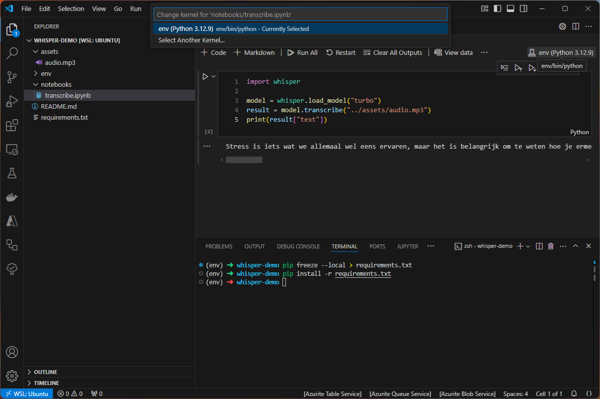

# Whisper demo

## Get started

Create python env:

```bash
python3 -m venv env
```

Activate env:

```bash
source env/bin/activate
```

Install dependencies:

```bash
pip install -r requirements.txt
```

Install Jupyter extension:
https://marketplace.visualstudio.com/items?itemName=ms-toolsai.jupyter 

Select venv as Python kernel:


Run notebook!